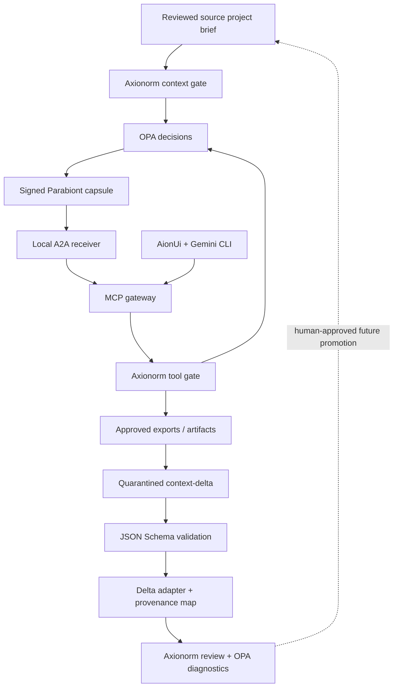

# Reference architecture and scope

OPA evaluates two policy domains. Axionorm normalizes policy/input, checks review/content, projects the permitted context and enforces decisions. Parabiont carries already-filtered context: raw private history never travels to the destination before being 'intercepted'. PARALAX's initial orchestration connects review → seal → deliver → tool access → quarantined return proposal → review. The dashed promotion edge is intentionally not automated.

`paralax-delta` is the boundary adapter between the richer `parabiont-delta/v0.1` proposal and Axionorm's narrower `parabiont-candidate/v0.1` review input. It preserves the exact source bytes and SHA-256, records per-item provenance/confidence/supersedes fields, records every explicitly added label, and emits the candidate/review/policy digests needed to audit the transformation.

The source adapter accepts a curated JSON candidate; it cannot automatically read ChatGPT's hidden memory or act as the consumer app's native A2A endpoint. The destination is a local receiver; Google sees state only when the authenticated Gemini runtime requests it through MCP. A2A is pinned to 0.3, MCP to the official Python SDK 1.30.0; no latest-version or full-standard certification is claimed.

## Trust assumptions

- The user/OS controls policy, approved digests, keys, issuer public key, SQLite state and executable paths. An attacker able to replace those control files is outside this reference's boundary.
- Agents never receive signing keys, review mutation tools, OPA management tools, shell execution or package installation capabilities.
- Files are flat exported copies, explicitly reviewed by digest. POSIX no-follow opens reject symlinks; hard links, non-regular files, size excess and changed content fail closed.
- OPA failure denies. Policy digest changes invalidate bonds. Gateway checks each call; modifying policy requires a new reviewed handoff.
- No native model tool may bypass the MCP gateway. Generated Gemini system/admin policy denies native tools and other MCP servers. This is application enforcement; OS/container isolation is needed against a compromised host process.
- Pattern matching is defense in depth. Human review is necessary for sensitive prose not recognized by a deterministic filter. Approved context is sent as data, but natural-language injection cannot be perfectly classified.
- Tool replies and artifacts are untrusted. Delta validation or an OPA allow decision is not authoritative promotion. No automatic memory promotion, execution or installation occurs. No actual user private history is embedded in tests, examples or repositories.

## Deliberate v0.1 limits

No remote A2A authentication/TLS deployment, native ChatGPT integration, automatic subscription reuse, cloud browser, unrestricted shell, provider API call, full AI Council scheduler, distributed revocation or remote forgetting. The user installs/authenticates the desktop runtime. The combined installer and local demo are usable without any provider login.

Future work should first turn the verified local return adapter into a version-negotiated promotion controller, expose effective Rego requirements through a machine-readable policy contract, measure policy latency, and add package-specific installer approvals and narrowly scoped task runners. Preserve the same purpose/audience/data boundaries when adding another provider.
